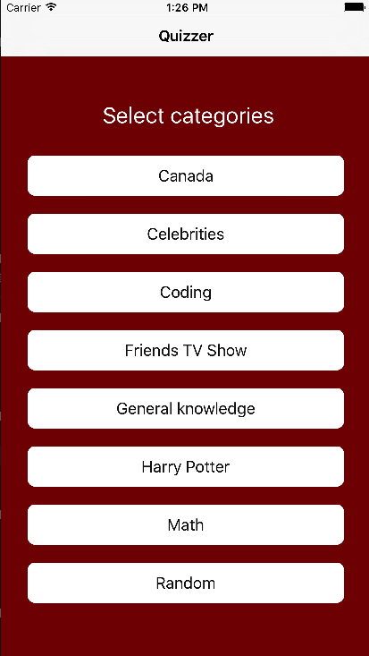

### Quizzer


### Mission Statement
Quizzer is a trivia game for you to explore your knowledge in different categories

---
### Introduction
Quizzer is quiz trivia game for iOS devices, made with react-native.
On the homepage you can choose from different categories and it will render the questions related to that category. The categories include celebrities, coding, general knowledge, trivia, maths and so on.
It's a fun way to relax and unwind.

---

### Technologies Used:
* React
* React native
* JavaScript ES6, JSX
* Node.js
* Express.js
* PostgreSQL
* Firebase

---

### User Stories version 1:
#### Landing Page
* As a user, the page application homepage should be welcoming
* As a user, I should be able to type my name
* As a user, I should be able to start the game

#### Playing the game
* As a user, after i start the game i should be able to choose from different quiz categories
* As a user, I should be able to see the questions relating to the category I selected
* As a user, I should be able to select an answer to the question
* As a user, after I select an answer to the question I should know if my answer was correct or not
* As a user, I should be able to see the next question if my answer is correct
* As a user, I should be able to reset the game in the middle of a quiz
* As a user, I should be able to quit a quiz
* As a user, after a quit a quiz I should see options to select another category or play as a different player
* As a user, I should be able to see my score after the end of questions in a particular category
* As a user, I see an option to select another category after I finish a quiz
* As a user,I should see an option to play as another player after I finish a quiz

#### Bonus
* As a guest, there should be a landing page that allows me to sign up/login for the application
* As a guest, I should be able to sign up for the application
* As a member, I should be able to log in if i already have an account
* As a member, after I log-in, the page should be welcoming and it should let me complete most of the application functions from this page
* As a member, I should be able to see my scores in the categories that I have played
* As a member, I should be able to log out of the application

---

### API Design:
The idea was to create an api that will be deployed online and the application will hit the api to get the data based on different routes.
API will be manually seeded with questions and images for different categories.Below is the structure of the JSON object that will hold the data for different categories
```
[
      {
          "id": "1",
          "question":"Question related to the category?",
          "image": "link to the image related to the question",
          "correct": 2,
          "answers": [
              {
                  "id": "1",
                  "answer": "option1"
              },
              {
                  "id": "2",
                  "answer": "option2"
              },
              {
                  "id": "3",
                  "answer": "option3"
              },
              {
                  "id": "4",
                  "answer": "option3"
              }
          ]
      },

```
---

### Wireframes:
<p align="center">
  <p>Landing Page </p>
  <p>Gameview </p>
  <p>Quizview </p>
  <p>End Game </p>
</p>

---

### App Preview:

### Installation Instructions(To be Added):

### Future Implementations(To be Added):
